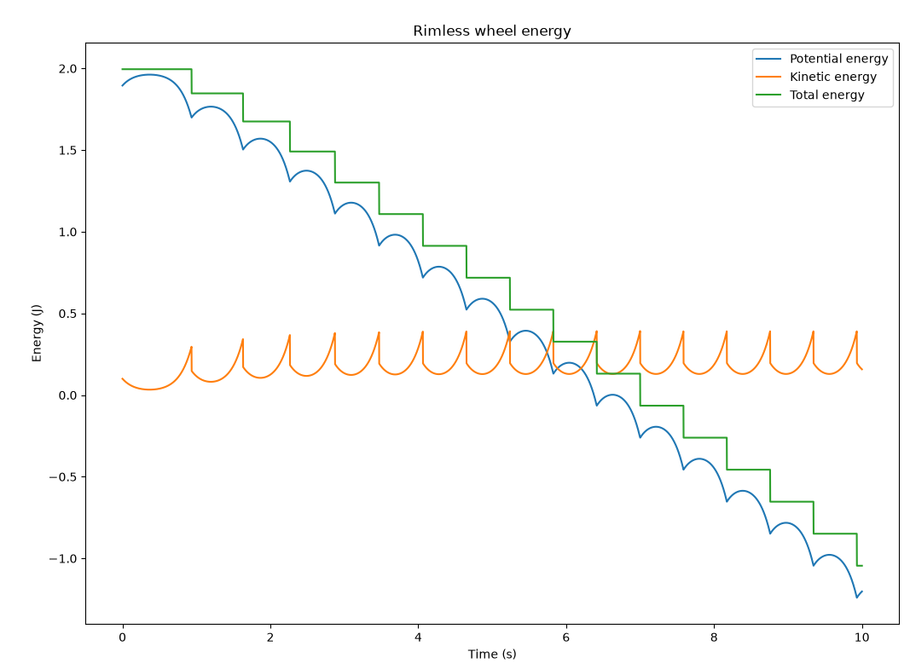
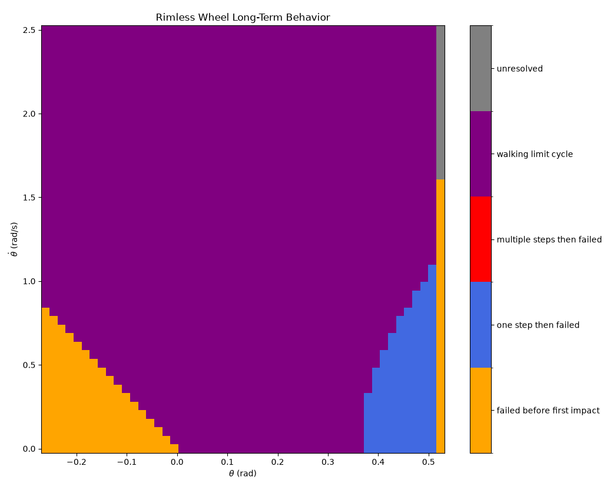
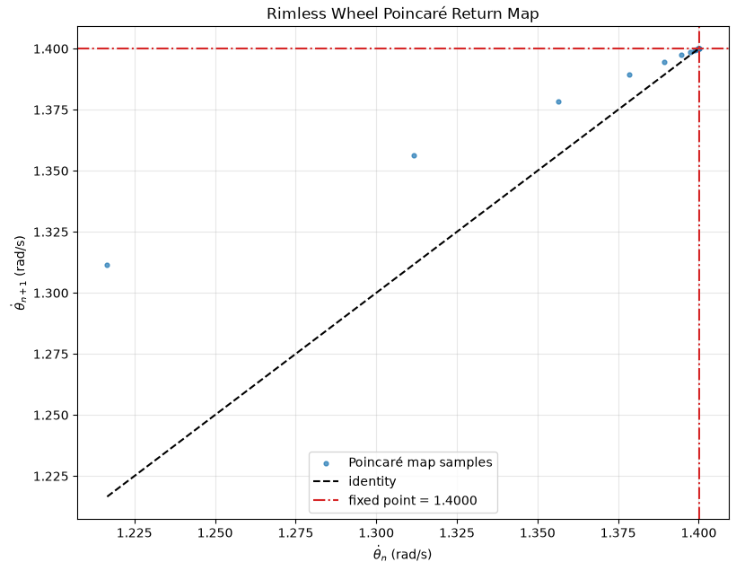
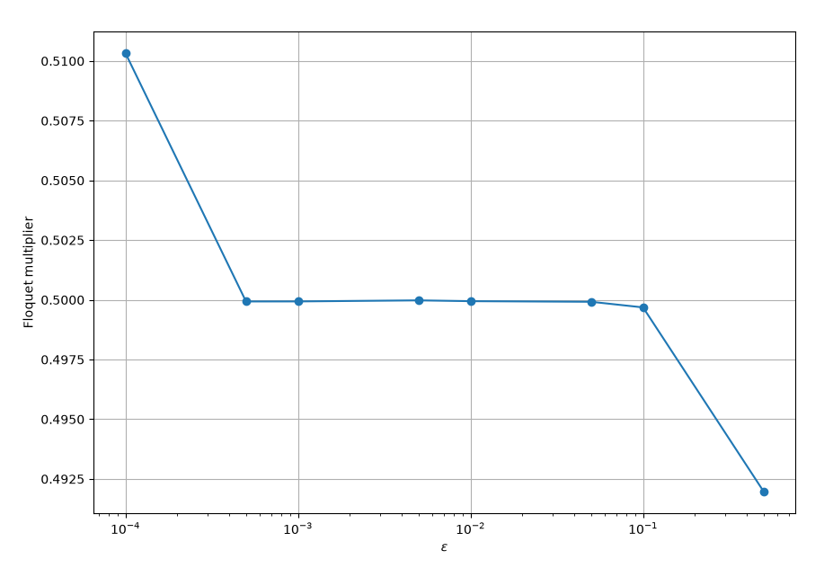

# Assignment 1

## Rimless wheel model sanity checks:

In order to check the dynamic model developed for the rimless wheel is correct, I decided to look at the energy behavior of the system. Plotting the kinetic, potential, and total energies of the system, I would expect the energy of the system to bve constant between impacts, and to drop when the wheel takes a step through the angular velocity reset following $\dot{\theta}^+ = \dot{\theta}^- \cos(2 \alpha)$. For the stable rolling case, I would expect the kinetic energy plot to show as a repeating pattern that does not decay with time, while the potential energy of the system drops each time a spoke impacts the ground due to the change in height. The system only reaches its long term behavior when the loss in potential energy during a step is balanced with the loss in kinetic energy at impact. Due to the way the dynamics are implemented, contact is detected only when a spoke reaches the next contact angle. If the wheel does not have enough energy to pass the vertical configuration, it instead reverses direction and behaves like a pendulum about the current contact point. This represents one of the failure modes considered in the Region of Attraction analysis.

## State  Space plot showing the region of attraction

For the region of attraction of the rolling limit cycle, I would expect three main behaviors. The first would be stable rolling as mentioned above. The second would be taking one step and stopping due to the system not having enough energy to complete the next step, and the third would be the inverted pendulum not reaching the vertical and falling back. From the image above, we can see the majority of the region of attraction grid is spanned by the stable rolling case in purple. There are two other regions, a yellow section where the platform angle and initial velocity conbination is such that the spokeless wheel does not reach the first step, and a blue region where it stops after reaching the first step since the energy drop after impact is too high, and it cannot reach thevertical during the next step and falls back. The boundary between these regions therefore represents the initial conditions from which the rolling limit cycle can or cannot be reached.

## Poincare map and 

The poincare map above shows the relationship between the post-impact angular velocities of consecutive steps, which converges toward a stable fixed point. It is possible to see how early in the simulation, post-impact velocities are far apart, but then start converging toward the identity line at a fixed point of approximately 1.400013 rad/s. This corresponds to the point where the energy acquired by the change in height of the new fulcrum perfectly equalizes the energy loss due to the reset as mentioned in the first section, forming a limit cycle. Furthermore, the floquet multiplier can be estimated by analyzing how different perturbances behave around this fixed point. The floquet multiplier can be interpreted as the rate at which the convergence above happens,  and thus it can be estimated numerically by taking the slope of the different impacts in the poincare section. 

The figure above shows the estimated Floquet multiplier for different perturbation magnitudes. For very small perturbations, numerical integration and impact-detection errors begin to dominate, while for large perturbations, nonlinear effects become detrimental too. The estimates converge over a range of perturbations around 1e-3, which we can then use in order to estimate the value of the multiplier at 0.499933. This value is lower than 1 as expected given the convergence.

## Slope and spoke number sweep

Finally, both the spoke number and platform inclination were varied in order to investivgate the effects of these parameters on the region of attraction and stability olf the limit cycle through a floquet multiplier analysis. For inclination, I would expect a larger number of initial conditions to lead to stable rolling, as more energy is introduced after the first step, shrinking the blue region on the roa. The number of spokes would affect both the frequency, impact angle, and energy lost per step, so the plots inform what the correlation between these factors would be, both in terms of initial conditions and stability. 

(The sweep has been running for over an hour now, so I'll just upload in the meantime)
